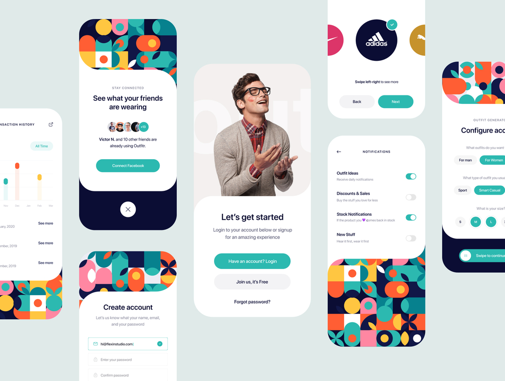

<h1 align="center">
a bettea     
</h1>

 
  
  
  

  <a href="#-about">About</a>&nbsp;&nbsp;&nbsp;|&nbsp;&nbsp;&nbsp;
  <a href="#-layout">Layout</a>&nbsp;&nbsp;&nbsp;|&nbsp;&nbsp;&nbsp;

 

## &nbsp; About

This is a simple application developed using React Native. The app is based on the Outfitr - Fashion UI Kit from Flexin Studio (https://gumroad.com/l/sfEm)

## &nbsp; Layout

 

---

Made with ❤ by Isaque Igor!  
[Follow me on social networks!](https://linktr.ee/isaqueigor)
